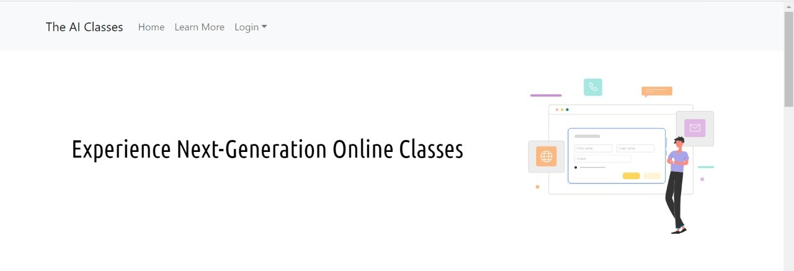
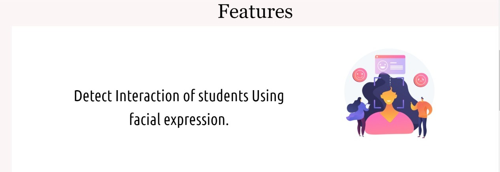
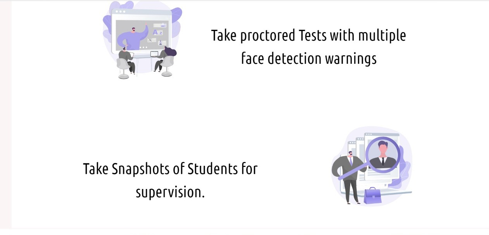
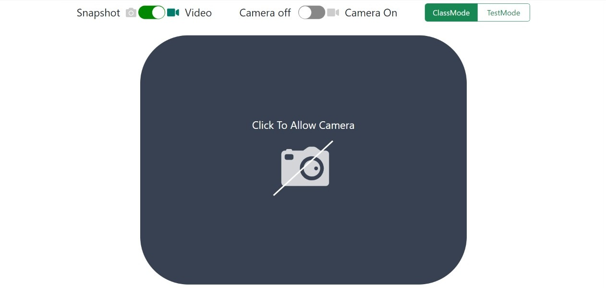
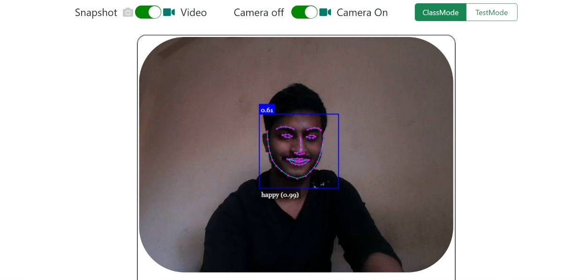
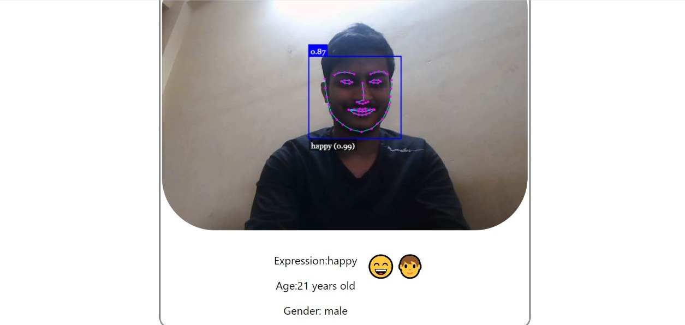
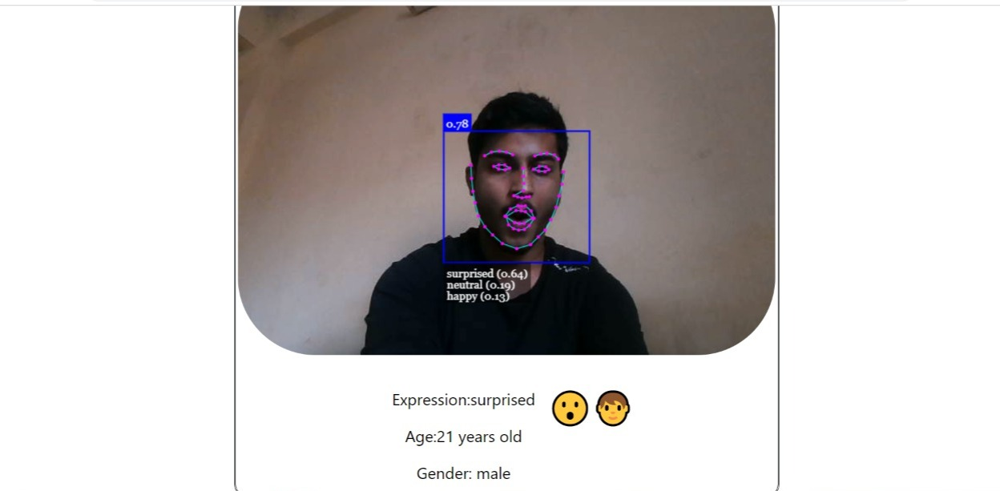
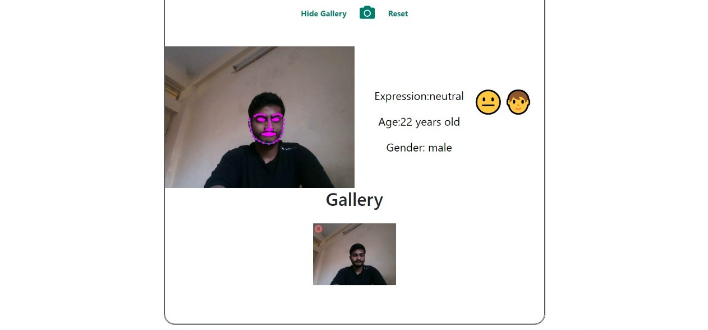
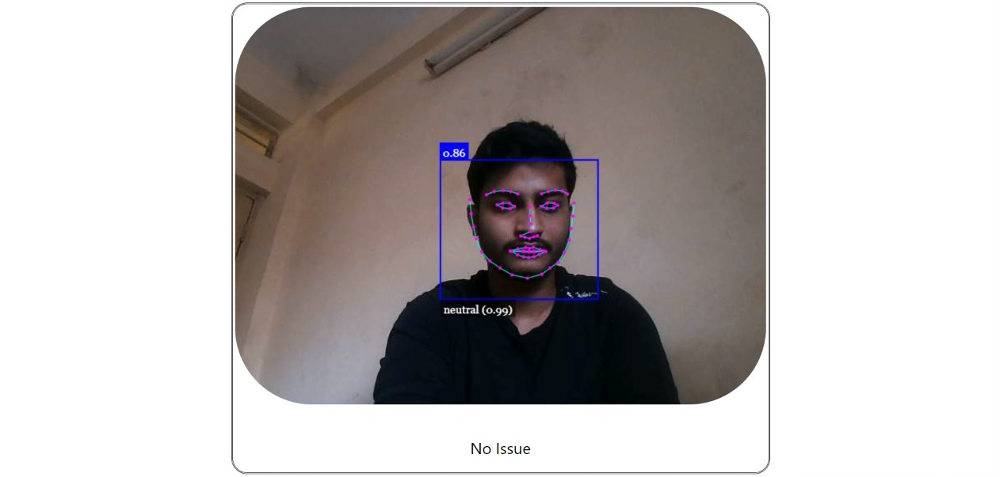
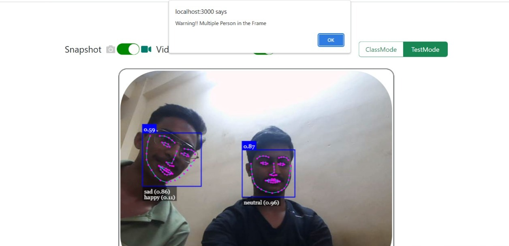

# imbesideyou Intern Application
## Name: Mohsin Iftekhar
## University: Indian institute of technology Dhanbad (IIT DHANBAD)
## Department: Electrical Engineering
## Admission Number: 20je0579
## Email:20je0579@ee.iitism.ac.in

# Welcome to Next Generation Online Education
I created an app using **React.js** and **face-api.js** for **detecting emotions** , **creating realtime face-mesh** ,**detecting gender** and **predicting age** of students using models.
<!-- App created on top of **face-api.js** used for detecting **face emotions** and creating **face mesh** in realtime. App uses users **webcam** to create video stream and uses models to detect faces and emotions. -->

## Idea Of The Project
1. This project aims to incorporate artificial intelligence in the field of Online Education.
2. Teachers can supervise the interaction of the student in the class by facial expressions and can analyze their behaviour during the class.
3. There is a feature of TestMode which would be operational while taking online tests. It detects multiple faces and alerts the student which freezes the screen.


# Technologies Used

- **Reactjs**
- **Bootstrap, css**
- **Face-api.js**

## Functionality

AI generates **face mesh** and predicts **facial expressions**,**age** and **gender**.
**I have Implemented AI functionality on frontend**
### AI implemented on Frontend
1. In frontend Client Browser Sends realtime video to AI on frontend which analyzes and sends response back.

#### Advantages
1. High response time as realtime video is not sent to backend servers.

#### Drawbacks
1. Accuracy is low.
2. Limited computing power on frontend due to small sized training models.

### If AI is implemented on Backend
1. When AI is implemented on backend client browser processes and sends video to backend AI.
2. Backend AI analyzes the data of video and sends a response to express app.


3. Express App then sends the response to client Browser.
#### Advantages
1. Accuracy is high.with large computing power.
2. Large sized models are trained on backend.
3. Excessive computing power
#### Disadvantages
1. Process of Sending realtime video to backend servers for analyzation would lead to excessive delays.
2. Bad experience.
### IMAGES

#### Features


#### AI in Action


#### I have implemented 4 different modes of operations
1. ClassMode-In this Mode AI produces the face Mesh and displays Various emotion of the student during the course of the class.
2. TestMode-In this Mode AI detects the face and if multiple faces are detected Warning is issued.
3. VideoMode-In this Video Stream runs and AI produces realtime Facemesh and displays desired results based on ClassMode and TestMode.
4. SnapShot-In this Snapshots can be taken and desired results are displayed based on the image captured by Snapshot.  

#### ClassMode 


#### Snapshot Mode

#### TestMode



## Running the server

Clone the repository:

```bash
git clone https://github.com/Mohsin-iftekhar/TheAiClasses.git
```
## Demo
```bash
Check Live site here: https://main--harmonious-lily-10ada8.netlify.app/ 
```
Deployed on netlify
